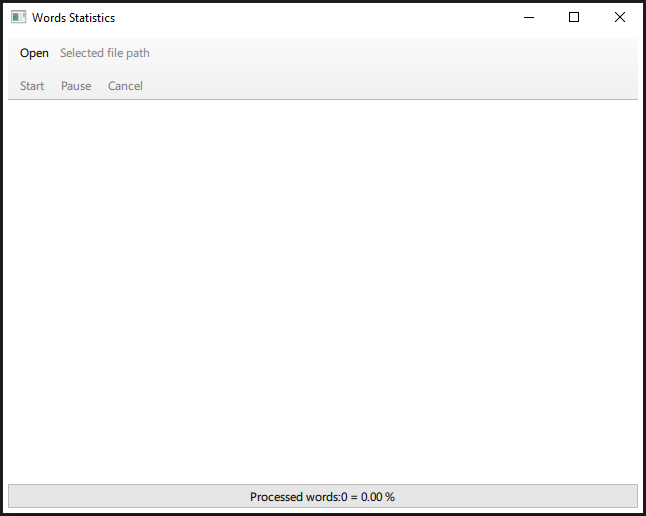
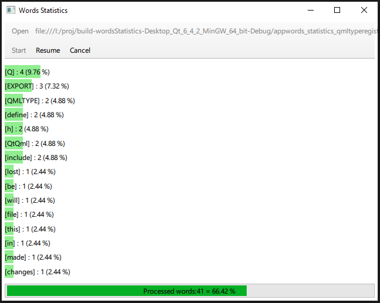

# Words Statistics  
приложение для подсчета количества слов в выбранном файле и отображения в виде гистограммы самых часто использованных 15 слов. (Количество настраивается, но пока задано жестко в коде)  
Словами считается любая печатная последовательность символов.  
`std::isgraph`  
Разделителями между словами являются любые пустые символы и любые пунктационные символы в соответсвии с таблицей для `std::isspace`, `std::ispunct`

https://en.cppreference.com/w/cpp/string/byte/isspace

Имеет простой интерфейс   

Панель управления (ToolPanel.qml):
Open - для выбора файла для чтения.
Рядом текстовое поле для тображения URL выбранного файла.  
Ниже кнопки управления процессом подсчета слов в файле.
Кнопки панел имеют простую логику определения активности кнопки. (Пока не связана со статусом класса `Controller`)

По центру область отображения горизонтальной гистограммы частоты использования слов (Histogram.qml).  
Отображаются топ 15 самых часто использованных слов в файле: имя, количество повторов, % от общего числа слов.  
Чем чаще использовано слово тем выше в списке будет отображено.  

Внизу отображена область прогресса для отображения общего прогресса обработки файла.

# Описание архитектуры  

При реализации использован фреймворк **Qt 6.4.2 MinGW, CMake**. Интерфейс - Qt.Quick (QML).
Ядром приложения является модель сбора и хранения статистики слов.  
`WordsStatisticsModel` (файл wordsstatisticsmodel.h / .cpp)
Класс имеет общедоступный слот appendWord, который выполняет или добавление нового уникального слова в модель или увеличивает счетчик, если такое слово уже было добавлено.  

Данный слот вызывается по сигналу от контроллера чтения слов из файла.
Класс `Controller` (файл controller.h / .cpp) реализует управление потоком чтения слов из файла и предоставляет достаточный интерфейс для вызова управления со стороный UI (QML).  
Чтение слов из файла происходит по одному в отдельном потоке.  
Поток реализван через вынесение экземпляра в поток, а не через наследование от `QThread` (класс Worker файл файл controller.h / .cpp)

Для отображения данных модели в QML в отсортированном и отфильтрованном виде использован `SortAndFilterProxy` наследник класса `QSortFilterProxyModel` в котором переопределены методы `lessThan` для сортировки, `filterAcceptsRow` для фильтрации элементов, чья статистика использования ниже последнего доступного для отображения 15-го элемента.  
Кроме того, для сокрытия элементов, которые прошли фильтр, но более не должны быть отображены (вышли за границы максимального индекса отображаемых элементов) в QML определено свойство `visible: index < SortFilterProxyInstance.maxRows` для делегата `Repeater`.  

# Что еще можно было бы сделать?  

- добавить enum с ролями, чтоб не ошибаться с индексом относительно Qt::UserRole
- добавить анимацию смены позиций в гистограмме. 
- Unit tests для модели. 
- Привязку состояния кнопок панели управления к статусу экземпляра `Controller`
- Назначить кнопкам панели общепринятые иконки
- чаще выполнять clang-tidy и разрешить ошибки, предупреждения  
- выполнить замеры производительности и определить потенциальные узкие места (Win е имеет perf).  
- настройка стилей
- локализация